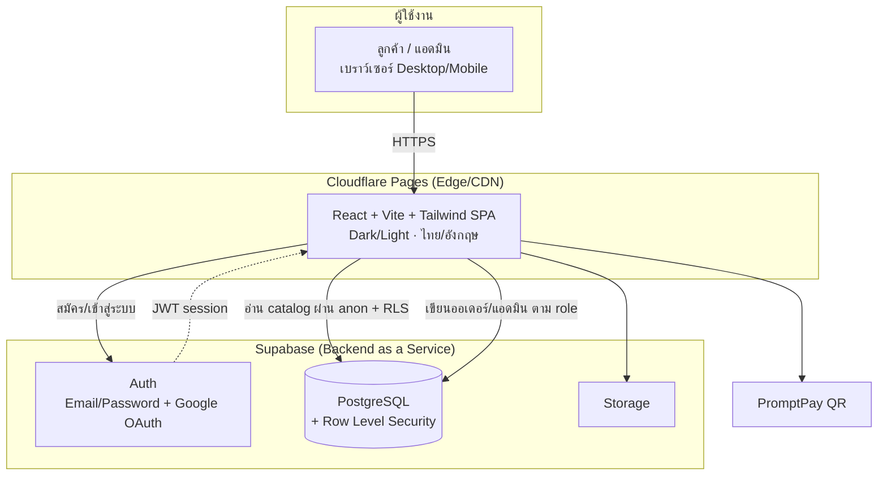
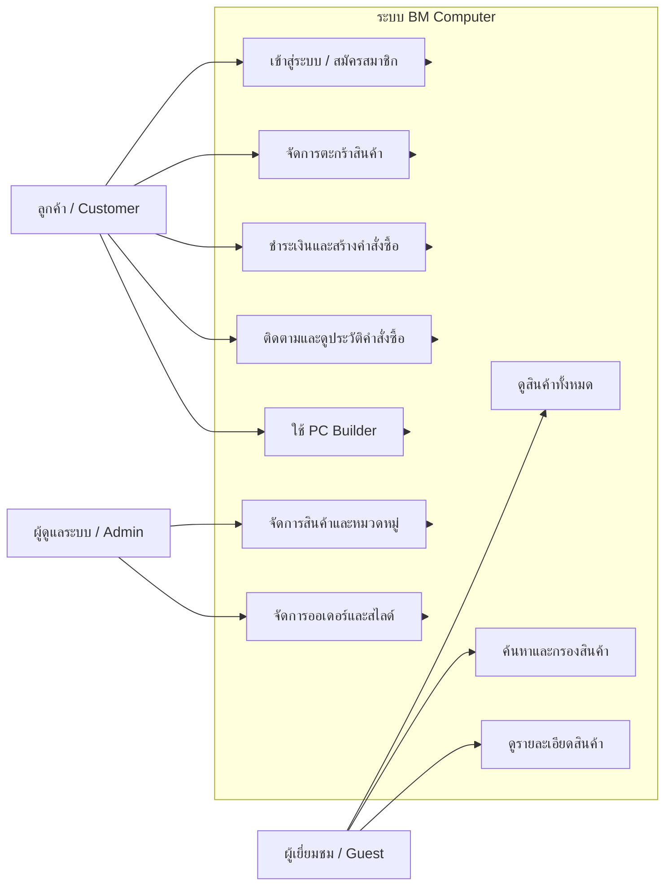
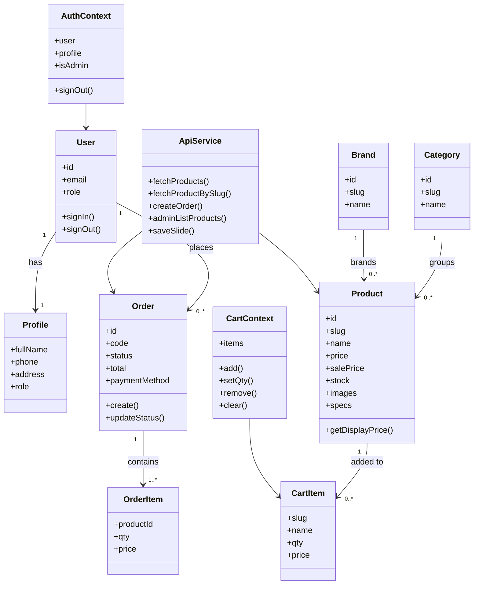

  

<h1 align="center">BM Computer (บ้านมีคอม)</h1>

ระบบร้านค้าออนไลน์จำหน่ายอุปกรณ์คอมพิวเตอร์ · รายวิชา CSI204

  🌐 <b>เว็บไซต์:</b> <a href="https://bm-computer.pages.dev">bm-computer.pages.dev</a> ·
  📦 <b>ซอร์สโค้ด:</b> <a href="https://github.com/manatsawintho-ragoon/bm-computer">GitHub</a>

---

## 1. ข้อมูลโครงงาน
**ชื่อโครงงาน:** BM Computer (บ้านมีคอม) - ระบบร้านค้าออนไลน์จำหน่ายอุปกรณ์คอมพิวเตอร์
**รายวิชา:** CSI204 - ดิจิทัลแพลตฟอร์มสำหรับพัฒนาซอฟต์แวร์

**ผู้จัดทำ**

| ลำดับ | รหัสนักศึกษา | ชื่อ-นามสกุล | ตำแหน่ง |
|:----:|:------------:|--------------|---------|
| 1 | 67091885 | มนัสวิน ทองดี | Project Manager |
| 2 | 67133473 | ประสบการณ์ ผมพันธ์ | Developer (Fullstack) |
| 3 | 67131315 | ณภัทร พิชัยรัตน์ | Developer (Fullstack) |
| 4 | 67129568 | สิทธา ว่องคุณากร | Developer (Fullstack) |
| 5 | 6711886 | คชาณบ สวัสดี | Developer (Fullstack) |

---

## 2. วัตถุประสงค์ของโครงงาน
1. พัฒนา **เว็บไซต์ร้านค้าออนไลน์ที่ใช้งานได้จริง** สำหรับจำหน่ายอุปกรณ์คอมพิวเตอร์ครบวงจร
2. ออกแบบประสบการณ์ผู้ใช้ (UX/UI) ที่ทันสมัย ใช้งานง่าย รองรับทุกอุปกรณ์ (Responsive) ทั้งโหมดสว่าง/มืด และ 2 ภาษา (ไทย/อังกฤษ)
3. สร้างระบบที่ **ควบคุมเนื้อหาทั้งหมดได้จากหลังบ้าน (Dynamic + Admin CMS)** - เพิ่ม/แก้/ลบสินค้า สไลด์ และเนื้อหา แล้วแสดงผลบนเว็บทันที
4. นำหลักการ **กระบวนการพัฒนาซอฟต์แวร์ (SDLC)** และเครื่องมือจริง (Git/GitHub, CI/CD) มาประยุกต์ใช้
5. ฝึกพัฒนาระบบที่ให้ความสำคัญกับ **ความปลอดภัย ประสิทธิภาพ และความเร็ว** ในระดับใช้งานจริง

---

## 3. เทคโนโลยีที่ใช้ (Tech Stack)
| ส่วน | เทคโนโลยี |
|------|-----------|
| **Frontend** | React 18, Vite, React Router |
| **Styling/UI** | Tailwind CSS v4 (Design Tokens), Dark/Light Mode, ฟอนต์ Inter + Sarabun |
| **i18n** | ระบบ 2 ภาษา (ไทย/อังกฤษ) ด้วย React Context |
| **Backend / Database** | **Supabase** - PostgreSQL, Row Level Security (RLS) |
| **Authentication** | Supabase Auth (Email/Password + รองรับ Google OAuth) |
| **Storage** | Supabase Storage (รูปภาพ) |
| **Hosting / Deploy** | **Cloudflare Pages** (CI/CD อัตโนมัติจาก GitHub) |
| **Version Control** | Git + GitHub |
| **Payment** | PromptPay QR |
| **เอกสาร/ออกแบบ** | Markdown + Mermaid Diagram |

---

## 4. สถาปัตยกรรมระบบ (SDLC)
ใช้กระบวนการพัฒนาแบบ **Iterative / Agile** - พัฒนาเป็นรอบ ส่งมอบเป็นเฟส และปรับปรุงต่อเนื่อง

| เฟส | กิจกรรมในโครงงานนี้ |
|-----|---------------------|
| **1. Planning** | กำหนดขอบเขต ฟีเจอร์ กลุ่มผู้ใช้ และเทคโนโลยี |
| **2. Design** | ออกแบบ UX/UI (ธีมแดง-ขาว-เทา), โครงสร้างหน้า (Wireframe), โมเดลข้อมูล (ERD), สถาปัตยกรรมระบบ |
| **3. Development** | พัฒนา Frontend (React) + ต่อฐานข้อมูล Supabase + ระบบ Auth/ตะกร้า/สั่งซื้อ/หลังบ้าน |
| **4. Testing** | ทดสอบการทำงานจริงผ่านเบราว์เซอร์ (ตะกร้า/ชำระเงิน/ออเดอร์), ตรวจ Console/Build |
| **5. Deployment & Maintenance** | Deploy บน Cloudflare Pages (auto-deploy ทุก `git push`) + ปรับปรุงต่อเนื่อง |

> ทุกการเปลี่ยนแปลงที่ push ขึ้น GitHub branch `main` จะถูก Build และ Deploy ขึ้นเว็บโดยอัตโนมัติ (CI/CD)

---

## 5. ขอบเขตของระบบ
**ฟังก์ชันในระบบ (In Scope)**
- 🛍️ หน้าร้าน (Storefront): Hero Carousel, Flash Sale (นับถอยหลัง), แถบแบรนด์, สินค้าแนะนำ/มาใหม่ - **ดึงข้อมูลจากฐานข้อมูลจริง**
- 🔎 รายการสินค้า + ค้นหา + กรองตามหมวด/แบรนด์ + รายละเอียดสินค้า + แกลเลอรีซูม (Lightbox)
- 🛒 ตะกร้าสินค้า (เพิ่ม/ลบ/แก้จำนวน) + ชำระเงินด้วย **PromptPay QR** + สร้างคำสั่งซื้อจริง
- 👤 ระบบสมาชิก (สมัคร/เข้าสู่ระบบ) + ติดตามสถานะ + ประวัติการสั่งซื้อ
- ⚙️ จัดสเปคคอม (PC Builder)
- 🛠️ ระบบหลังบ้าน (Admin): จัดการสินค้า/หมวด/แบรนด์/สไลด์/เนื้อหา/ออเดอร์ *(กำลังพัฒนา)*
- 🌗 Dark/Light Mode · 🌐 ไทย/อังกฤษ · 📱 Responsive

**นอกขอบเขต (Out of Scope) - เฟสปัจจุบัน**
- การเชื่อมต่อ Payment Gateway จริง (ปัจจุบันใช้ QR ตัวอย่าง) · แอปมือถือ Native · ระบบขนส่งจริง

---

## 6. คุณค่าของโครงการ (Value Proposition)
- **ครบ จบ ในที่เดียว** - เลือกซื้ออุปกรณ์คอมพิวเตอร์ พร้อมฟีเจอร์ช่วยจัดสเปค
- **คุมได้จากหลังบ้านทั้งหมด (Dynamic)** - ร้านอัปเดตสินค้า/โปรโมชัน/หน้าเว็บได้เองโดยไม่ต้องแก้โค้ด
- **ปลอดภัย** - ควบคุมสิทธิ์การเข้าถึงข้อมูลด้วย Row Level Security ระดับฐานข้อมูล
- **เร็วและประหยัด** - โฮสต์บน Edge Network ของ Cloudflare (ฟรี) + Query ที่ออกแบบให้เร็ว
- **ประสบการณ์ลูกค้าดี** - UI ทันสมัย ใช้งานง่าย รองรับมือถือ ไทย/อังกฤษ และโหมดมืด
- **พร้อมต่อยอด** - โครงสร้างพร้อมขยายสู่ระบบจริงเต็มรูปแบบ (Payment, CRM, การจัดส่ง)

---

## 7. System Architecture

**หลักการสำคัญ**
- Frontend เป็น Static SPA เสิร์ฟผ่าน Cloudflare Edge → โหลดเร็วทั่วโลก
- ข้อมูลทั้งหมดมาจาก Supabase แบบ Dynamic - แก้ที่ฐานข้อมูล/หลังบ้าน เว็บเปลี่ยนทันที
- ความปลอดภัยบังคับที่ชั้นฐานข้อมูล (RLS): ลูกค้าเห็นเฉพาะข้อมูลตนเอง, แก้ catalog ได้เฉพาะ Admin

---

## 8. Use Case Diagram

**ความหมายของแผนภาพ**
- ผู้เยี่ยมชมสามารถดูสินค้าและค้นหาได้ก่อนล็อกอิน
- ลูกค้าต้องเข้าสู่ระบบก่อนใช้ฟีเจอร์ตะกร้า ออเดอร์ และการติดตามสถานะ
- แอดมินมีสิทธิ์จัดการข้อมูลสินค้า ออเดอร์ สไลด์ และการตั้งค่าเว็บไซต์ผ่านแดชบอร์ด

---

## 9. Class Diagram

**ภาพรวมของแบบจำลองคำสั่งและข้อมูล**
- `AuthContext` และ `CartContext` เป็นตัวจัดการสถานะหลักของหน้าเว็บ
- `ApiService` ทำหน้าที่เชื่อม React frontend กับ Supabase backend
- `Product`, `Order`, และ `OrderItem` เป็นโครงสร้างข้อมูลหลักสำหรับร้านค้าออนไลน์

---

© 2026 BM Computer (บ้านมีคอม) · CSI204

